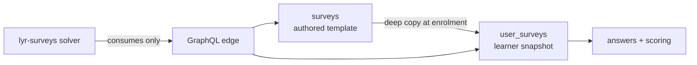
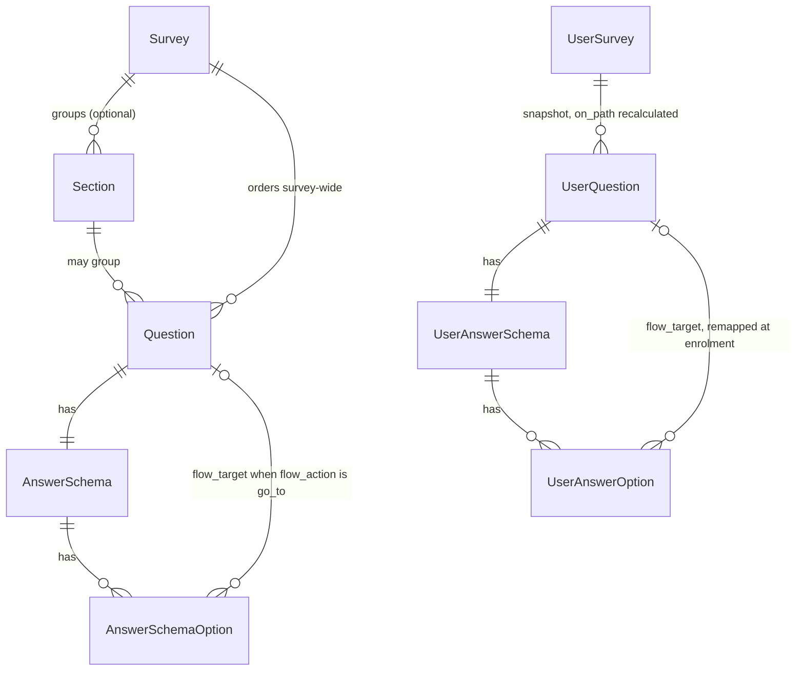
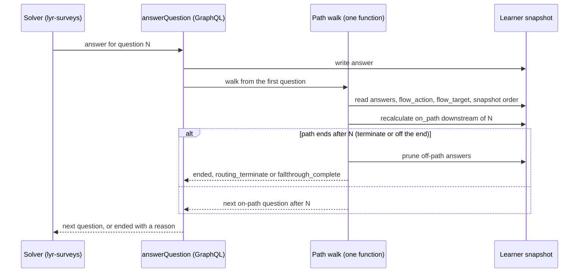

# Architecture Spine — forms

## Design Paradigm

A Django project, and the exception in a backend otherwise built ports-and-adapters. It is organised as Django apps — `accounts/`, `assessment_exports/`, `classifications/`, `external_references/` — around a conventional `app/` settings package with a GraphQL surface (`schema_common.py`), its own permission catalogue and database routers. A reader arriving from any sibling service will find none of `domain/ app/ infra/ interface/` here, and that difference is structural rather than an oversight.

### The flow engine's shape: template and snapshot

The authored tree (`Survey` → `Section` → `Question` → `AnswerSchema` → `AnswerSchemaOption`) is
a template nobody answers. At enrolment the whole tree is deep-copied into a parallel per-learner
tree (`UserSurvey` → `UserSection` → `UserQuestion` → `UserAnswerSchema` → `UserAnswerOption`),
and every attempt is read and written against that copy. Per-learner divergence is therefore
already the native shape of the schema: a per-learner path needs no new storage and no new copy
machinery, only routing columns riding the copy that already happens.

| Layer | Lives in | Owns |
| --- | --- | --- |
| authored template | `surveys/` | the survey an author builds; the only writer of the shared schema's DDL |
| learner snapshot | `user_surveys/` | one materialised copy per enrolment, and every answer |
| GraphQL edge | `*/schemas/`, `*/types/`, `*/inputs.py` | the admin and solver API surface |
| messaging | `app/messaging/` | JetStream publication and consumption |

## Inherited Invariants

`estate:AD-1` through `estate:AD-18` bind here read-only, except `estate:AD-6`, `estate:AD-10`
and `estate:AD-11`, which name other services. They are not re-keyed here. Where anything below
disagrees with one of them, the inherited decision wins and the disagreement is a conflict to
surface, not a local override. `backend` carries no decisions of its own.

Load-bearing in this scope — the rest bind without shaping anything below:

| Inherited | From parent | Binds here |
| --- | --- | --- |
| `estate:AD-2` | estate spine | A decision binding only `itq_forms` is an `AD` here, reviewed with this repo's code and pinned at its ref. A decision `itq_forms` and `itq_surveys` must *agree* on is an estate call — the ordering scope in `forms:AD-4` was one, and is pinned as `estate:AD-19`. |
| `estate:AD-3` | estate spine | Every citation here is namespaced. Every spine in the estate reaches its own first decision, so a bare id is unresolvable. |
| `estate:AD-8` | estate spine | Two ACL database roles: SELECT-only at runtime, write-capable only at deploy. `itq_forms` routes the ACL database in `app/db_routers.py`, so a flow evaluation may not write through that connection. |
| `estate:AD-14` | estate spine | N>1 replicas. Flow evaluation holds no in-process state — see `forms:AD-17`. |
| `estate:AD-18` | estate spine | A story reaches the build board whole and the build reads the story; no task is derived from this spine's epics. |

## Invariants & Rules

### AD-1 — A survey's primary locale is stored on the survey, never derived

- **Binds:** `backend/itq_forms`, `frontend/layers/lyr-surveys`
- **Prevents:** the backend and the authoring UI each deciding for themselves which language a
  survey is "really" written in, and disagreeing. Every translatable row keeps its own legacy
  column beside its translation rows, and at enrolment `_build_translations`
  (`user_surveys/services.py`) merges that column into **one** language's key — whichever the
  backend calls primary — wherever the translation for it is null or empty. The admin builder
  mirrors the same legacy columns from whichever language **it** calls primary. Where the two
  names differ, a learner reading language X is served text written in language Y under X's key:
  no error, no empty field, nothing to notice. It was reachable because the backend derived the
  primary from `survey.translations.first()` — `ORDER BY id` over a `uuid4` primary key, which
  names a language nobody chose and a different one per survey.
- **Rule:** the primary locale is the value of **`Survey.primary_language`**, falling back to
  `Survey.PRIMARY_LANGUAGE_FALLBACK` (`"default"`) where it is unset. Backend: read it through
  `Survey.primary_locale`, the single accessor every consumer routes through — the snapshot, the
  GraphQL type and `Survey.title`/`Survey.language` all go via it, and nothing queries the
  translations to answer this question. Frontend: read `Survey.primaryLanguage` over GraphQL. Do
  **not** derive a primary client-side, not even by a rule that matches the backend's today. No
  second derivation anywhere.
- **Why stored and not derived:** a derived primary — the alphabetically first authored language,
  say — moves the moment an author adds an earlier one, and that is not self-healing here.
  `create_survey_snapshot` deep-copies the survey into each learner's own rows at enrolment and
  **freezes** them; no later edit to the survey reaches a learner already enrolled. So between a
  move and a re-save of every affected row, each new enrolment permanently files the old
  language's body text under the new language's key, unreachable by any later fix. Both sides
  deriving the value identically does not help: at snapshot time they agree on the label and the
  text is still the other language's. The repair that would have closed the window is not
  available either — `SectionTranslation`, `QuestionTranslation` and `AnswerSchemaOptionTranslation`
  have no rows at all today (that absence is the gap the surveys builder exists to close), so
  mirroring the legacy columns "from the new primary's translation" would have been a no-op for
  exactly the rows at risk. A stored value moves only when someone moves it, which makes the move
  an act that can be paired with a repair.
- **Default and create rule (ruled 2026-09-29):** the column defaults to **`ar`**
  (`Survey.PRIMARY_LANGUAGE_DEFAULT`, ORM-level only, `surveys/migrations/0043`). `create_survey`
  sets the primary in the same INSERT: an explicit `primary_language` wins; else `ar` if the
  create carries an `ar` translation; else the first translation's language; else `ar`. Not the
  first translation alone — the admin form sends `[en, ar]` in locale order. `0044` moved every
  survey with no `UserSurvey` to `ar`; a survey with any enrolment keeps its primary, and the
  enrolled non-`ar` ones await a per-survey ruling (`tools/audit_primary_locale.sql` E).
- **Accepted costs:** one column and two migrations rather than a `Meta.ordering` line, and a
  write path that has to keep the column honest — `create_survey` sets it by the rule above,
  `SurveyTranslation.save()` claims only a column left explicitly null, and a `bulk_create`
  bypasses both and must set it itself. Existing
  rows were backfilled (`surveys/migrations/0041`) with the language the old
  `.first()`/`ORDER BY id` selector already returned, so the migration is behaviour-preserving by
  construction: no survey's primary moves as it lands. `tools/audit_primary_locale.sql` states
  that selector in SQL.
- **History:** first ruled the other way — `ordering = ["language"]` on the eight `*Translation`
  models, taking mutability as an acceptable cost because no translation model carries a
  `created_at` to order by instead. Reversed on 2026-09-24 once the interaction with frozen
  snapshots was spelled out: a mutable primary is not merely inconvenient for a value that gets
  copied into per-learner records and never revisited. Recorded here so the decision is not
  re-litigated from the implementation-cost angle alone, which is the angle that got it wrong.
  On 2026-09-28 (`0042`, v0.0.69) an `en` column default pre-empted the save-time claim, so every
  builder-created survey was filed under `en` whatever it was written in; replaced on 2026-09-29
  by the Arabic default and create rule above.

### AD-2 — The authored tree is a template; the learner's snapshot is the system of record for an attempt

- **Binds:** all flow evaluation, scoring and solver reads.
- **Prevents:** an attempt being evaluated against the author's current tree, so that editing a
  live survey silently changes the path of a learner already part-way through it.
- **Rule:** every read and write during an attempt resolves against the learner's own
  `UserSurvey` tree. Flow evaluation never reads `surveys/` rows. A survey edited after a learner
  enrols does not alter that learner's attempt. [ADOPTED — this is how enrolment already works.]

### AD-3 — Routing lives on the answer option, in two named columns

- **Binds:** the flow schema, the enrolment copy, and every mutation that authors an edge.
- **Prevents:** a second, parallel copy mechanism — a flow table the enrolment deep-copy does not
  know about — and, equally, two stories adding differently-shaped columns to the same table.
- **Rule:** an edge is exactly two columns on `AnswerSchemaOption`, mirrored on
  `UserAnswerOption`:
  - `flow_action`, a non-null stored string enum whose members are exactly `fall_through`,
    `go_to` and `terminate`, defaulting to `fall_through`. Fall-through is always stored
    explicitly and is **never** represented by null.
  - `flow_target`, a nullable foreign key to `Question` (`UserQuestion` on the snapshot), non-null
    **if and only if** `flow_action` is `go_to`.

  `go_to` and `terminate` are refused on a schema that admits more than one selected option, so
  one answer always yields one edge; a question with no options (free text, calculation) falls
  through. There is no separate edge table. The enrolment copy remaps `flow_target` onto the learner's own
  rows, the way the `Section.submit_action_target` self-FK is already remapped
  (`user_surveys/services.py:190-195`) — that is a section→section remap and this one is
  option→question, so the mechanism transfers but the code does not.

### AD-4 — Every question carries a survey-wide position, assigned by one function; sections are placed by position

- **Binds:** question ordering, `Question.Meta.ordering`, the reorder mutation, the backfill
  migration, section placement, and the forward-only check in `forms:AD-5`.
- **Prevents:** a sectionless question having no position and therefore no place in the order the
  flow falls through along — three independent renumber implementations (save path, reorder
  mutation, backfill) producing different 1..N sequences for the same survey — and a section
  whose questions are scattered, which no renderer can head once.
- **Rule:** `order` is assigned and renumbered across `survey_id`, for every question, whether or
  not it has a section. `Question.Meta.ordering` becomes `["order"]`. That one order is the
  authority, and sections are placed by it:
  - a section's questions are **contiguous** in survey-wide order; a write that would leave a
    section non-contiguous is refused with a named field error;
  - a section's position derives from its first question, and its heading renders immediately
    before that question;
  - sectionless questions sit between sections, never inside one;
  - moving a question across a section boundary changes its section — the reorder input names the
    destination section (or none) explicitly, and contiguity is checked after the write.

  Sections constrain nothing else: an edge may target any question in the survey. The
  `Question.section` foreign key is kept as the membership record, so no foreign-key migration
  runs through the cascading author-side keys `forms:AD-9` protects.

  **One function owns the renumber** — `renumber_questions(survey_id)` — and the save path, the
  reorder mutation and the backfill migration all call it. Its key is `(order, id)`; `Section.order`
  is rewritten by the same function to rank sections by their first question, with sections that
  hold no question placed after all others in their prior `order`. The backfill alone
  seeds `order` from the legacy key `(section.order nulls last, question.order, id)`. No other code
  assigns `order`.
- **Cross-service scope, ruled and enacted.** The estate ruled that `itq_surveys` adopts
  survey-wide scope, pinned as `estate:AD-19`; `surveys:AD-9` and `surveys:AD-17` were amended to
  match (`backend` `ed147dd`). Nothing in `itq_forms` waits on it any longer. The three carve-outs
  `estate:AD-19` left open wait on the `itq_surveys` build, which is deferred until this one
  finishes — see Deferred.

### AD-5 — An edge is forward-only, enforced by one predicate at every write

- **Binds:** edge mutations, reorder mutations, the enrolment copy, the ordering backfill.
- **Prevents:** a cycle. `forms:AD-6`'s evaluator depends on the forward-only guarantee to walk a
  path without loop detection, so one backward edge is not a bad route — it is a hung request
  thread. Equally prevents two surfaces each implementing their own comparison and disagreeing on
  a request that moves a question *and* edits an edge.
- **Rule:** an edge is valid only while its target's survey-wide position is greater than its
  source question's — survey-wide position on the author's tree, the learner's snapshot order
  (`UserQuestion.order`) on the copy. **One predicate owns this** — `assert_forward_only`, taking a survey or a learner snapshot and
  evaluated against the orders **as they will be after the write** — and the edge mutation, the reorder
  mutation, the enrolment copy and the ordering backfill all call it. No caller reimplements the
  comparison. A violation is refused with a named field error, never silently stored. Because the
  graph cannot contain a cycle, evaluation performs no cycle detection and no runtime loop guard.

### AD-6 — The server decides the next question, and says so in one shape

- **Binds:** the answer mutation, `should_terminate`, the solver in `lyr-surveys`.
- **Prevents:** the routing rule existing in two codebases and drifting — and the subtler failure
  of the write path and the poll path speaking two different vocabularies for *why an attempt
  ended*, against a solver that is permitted to cache what it was told.
- **Rule:** advancing an attempt returns **one named result type**: either the next question, or
  an ended marker carrying a reason from a single closed enum — `routing_terminate`,
  `ending_threshold`, `fallthrough_complete`, `force_terminated`. `should_terminate` returns a
  reason from that same enum. A nullable next-question field with no reason is not a legal shape.

  Going back is a navigation, not a decision: the solver may return to any question the server
  has placed on the current path (`forms:AD-19`), and re-answering it is an ordinary advance whose
  result the solver follows. The solver navigates to what it is given and never derives the next question from the snapshot,
  even though the snapshot contains every edge. This is a consumer contract on `lyr-surveys`, not
  a shared decision — it constrains only what a consumer may do with this service's output, and so
  does not reach `estate:AD-2`'s bar for an estate call the way `forms:AD-4` does.

### AD-7 — A routing terminate and the ending-option threshold are distinct, and terminate wins

- **Binds:** `flow_action = terminate`, `ending_option`, `count_of_ending_options`,
  `answers_count_to_end`, `should_terminate`.
- **Prevents:** two different intents collapsing into one column. `ending_option` is a *scored
  cutoff* — options are counted and the attempt ends only once the count reaches the survey's
  threshold. A routing terminate is an authored hard stop at one answer. Overloading either with
  the other would make one routing terminate change the behaviour of every ending option in the
  survey, because the threshold is survey-wide.
- **Rule:** `flow_action = terminate` is stored separately and `ending_option` is left exactly as
  it is. Where one option carries both, the routing terminate wins and the attempt ends
  immediately with reason `routing_terminate`: a reached hard stop is not undone by a threshold
  that has not been met. A routing terminate is decided on the write path, not discovered by a
  later `should_terminate` poll.

### AD-8 — Fallthrough past the last question completes the survey

- **Binds:** flow evaluation's terminal case.
- **Prevents:** an undefined end state when an option falls through and no question follows in
  order — the case every fallthrough path eventually reaches.
- **Rule:** `fall_through` advances to the next question in the learner's snapshot order
  (`UserQuestion.order`, which is survey-wide order unless `forms:AD-12` shuffled it); when none remains,
  the attempt completes with reason `fallthrough_complete`, exactly as reaching the end of the
  last section does today. An author is never obliged to draw an explicit terminate to end a path.

### AD-9 — Reachability is the only source of hiding, and the hidden-section carve-outs go with the flag

- **Binds:** question visibility, `Section.is_hidden`, and every query that filters on it.
- **Prevents:** two independent hiding mechanisms whose interaction nobody has defined — and the
  quieter failure of retiring the flag while the queries that read it stand, which is what renders
  9 published assessments at 0% in the PDF today (`user_surveys/pdf_service.py:101-104`, shipped
  v0.0.75).
- **Rule:** a question is shown if and only if the flow reached it. No element carries a
  visibility condition and no setting hides a section. `Section.is_hidden` is retired, and every
  carve-out that reads it is removed in the same release — at minimum the PDF's
  `.exclude(section__is_hidden=True)` and the solver's `isHidden` handling in
  `lyr-surveys/app/composables/solve/useSolveSteps.ts:104-122`, which is dead code with no caller
  **and the only place that already honours the flag**, so retiring the flag without it leaves a
  trap rather than a regression.

  Each hidden section's questions move to `section=null`. **The section rows are not deleted:**
  `AnswerSchema.section` and `AnswerSchemaOption.survey`/`section`/`question` are NOT NULL with
  `on_delete=CASCADE`, so dropping a `Section` row would cascade away the schemas and options of
  the very questions the migration intends to preserve. Either those author-side foreign keys are
  made nullable and re-pointed in the same migration, or the rows stay. The migration ships under
  `forms:AD-14`.

### AD-10 — Score basis is declared per assessment; an unreached answer does not score, an unreached calculation still computes

- **Binds:** scoring, result rendering, the PDF export.
- **Prevents:** two learners on different paths being scored against different denominators with
  no declared basis — and, separately, a later retrofit of the answer/calculation split, which
  would be a data migration over historic attempts.
- **Rule:** each assessment declares one basis: `answered`, `reached` or `all`, defaulting to
  `reached`. Under `answered` and `reached` a question the flow did not reach does not count; an
  unreached **calculation** still computes and still stores. A force-terminated attempt honours
  the declared basis with no special case. The split exists from the first migration. Because no
  survey in production carries a flow, `reached` and `all` are identical for every existing
  survey and the default is a no-op there.

### AD-11 — Flow is unavailable on `full_form`, and switching to it is refused

- **Binds:** the display option, the flow mutations.
- **Prevents:** authored routing that silently does nothing — which is exactly what the present
  unconditional section jump already is.
- **Rule:** `full_form` renders every question at once and has no step for an edge to land on, so
  flow is unavailable there. Switching an assessment that carries a flow to `full_form` is refused
  with a named error rather than leaving the flow dormant.

### AD-12 — Shuffle keeps the flow's anchors in place, and a shuffled step is never empty

- **Binds:** `randomize_questions`, the enrolment shuffle (`user_surveys/services.py:323-334`,
  which this replaces), the shuffle setting.
- **Prevents:** an author having to mark which questions are safe to shuffle and getting it wrong;
  a shuffle that changes **what an edge skips** — an edge also means "skip everything between here
  and the target", and moving a question into or out of that stretch silently reroutes it, which
  the middle mode as first written still allowed; a learner refused at enrolment because a shuffle
  pointed an edge backwards; and the documented randomisation-plus-hiding failure, where a step
  whose every question is unreached renders blank (`surveyjs/survey-library#9817`).
- **Rule:** a question is an **anchor** if any edge starts from one of its options or targets it.
  Anchorship is computed from the graph and is never a stored or authored field. Anchors keep
  their place; every other question shuffles only among the slots held by its own section (no
  section counts as one group) within its **gap** — between the adjacent anchors on either
  side — so sections stay contiguous (`forms:AD-4`).
  What each edge skips is therefore exactly what the author drew, for every learner, and the
  enrolment copy's `assert_forward_only` always passes.

  All three modes stay: shuffle all, shuffle only questions no edge touches (the default), and no
  shuffle. On a survey without a flow there are no anchors and "all" shuffles every question
  within its section group; on a
  survey with a flow "all" and the default coincide, and the builder says so. The shuffle runs
  once at enrolment and the order is locked for the attempt, so going back (`forms:AD-19`) is
  stable. Option shuffle (`randomize_options`) is unaffected. A step is presented only when the server
  issues a question in it (`forms:AD-6`), so a step the path skips is never presented empty. The shuffle's own `section__isnull=False` filter is removed by
  the release that makes sections optional.

### AD-13 — Required validation and result inclusion are scoped to the question, never to section membership

- **Binds:** `finish_assessment`'s required check, the results answer set.
- **Prevents:** an author marking a sectionless question required and getting neither enforcement
  nor a warning, and a sectionless question's answer silently vanishing from the results. Both
  exemptions exist today but are unreachable; making sections optional makes them live in the same
  release.
- **Rule:** no query that decides whether a question is enforced, scored or rendered may filter on
  section membership. Concretely that is `user_surveys/services.py:520`'s `section__isnull=False`
  on the required check and `:448`'s `exclude(question__section__isnull=True)` on the answer set,
  but the rule binds the invariant, not those two lines. The existing carve-out for a forced
  termination is unchanged: it remains guarded by the completion reason.

### AD-14 — Learner-data migrations are ordered, dry-run first, one per release

- **Binds:** the `is_hidden` retirement, the survey-wide ordering backfill, and any later
  migration over attempt data.
- **Prevents:** discovering the blast radius in production — every push of `itq_forms` main is a
  real release, so there is no quiet revert — and the subtler failure of the two migrations
  landing in either order and permanently producing different `order` sequences for the same
  survey, which neither migration's own counts would reveal.
- **Rule:** the two learner-data migrations in this epic are **ordered**: the survey-wide
  ordering backfill ships first, the `is_hidden` retirement second — so a hidden section's
  questions already hold their place when they lose their section, and the retirement changes
  only `section`. Each is preceded by a
  management command with `--dry-run`, reviewed before the migration ships; the backfill's dry run
  reports the resulting 1..N sequence per affected survey, not only counts. Data migrations ship
  in their **own** release, separate from the schema change and the feature code, and each carries
  a documented reversal.

  The ordering backfill also renumbers every **open** (unsubmitted) learner snapshot by
  `(UserSection.order nulls last, UserQuestion.order, id)` — which keeps a shuffled attempt's
  in-section order and makes its sections contiguous — so the snapshot order `forms:AD-5`,
  `forms:AD-8` and `forms:AD-18` read is defined for attempts already in flight. Submitted
  snapshots are not touched. The snapshot needs no *schema* migration: `UserQuestion.section`, `UserAnswerSchema.section`
  and `UserAnswerOption.section`/`.question` are **already** nullable. Making sections optional is
  an author-side nullability change.

### AD-15 — The legacy section jump is refused at the API, not dropped in this work

- **Binds:** `Section.submit_action`, `submit_action_target`, `SectionInput`.
- **Prevents:** a dead setting remaining authorable while the feature that replaces it ships.
- **Rule:** the API rejects `jump` and a non-null `submit_action_target` with a named field error.
  The columns stay; dropping them is deferred.

### AD-16 — Existing surveys do not change behaviour, and three author settings is the ceiling

- **Binds:** every default this epic introduces, and any later proposal to add a setting.
- **Prevents:** a release that silently re-scores or re-sequences the surveys live today — and the
  slower failure where every unresolved decision becomes a switch no author understands.
- **Rule:** a survey that carries no flow behaves exactly as it does today, at every default. The
  author-facing surface this epic adds is exactly two settings — shuffle interaction and score
  basis — alongside the existing display option; a fourth needs a forcing reason recorded as a new
  `AD`, not a story's judgement.

### AD-17 — Reachedness is recorded and recalculated, never replayed at scoring; evaluation holds no in-process state

- **Binds:** the answer write, scoring under `forms:AD-10`, the evaluator. [DERIVED —
  `estate:AD-14`.]
- **Prevents:** two compliant readings of `forms:AD-10` producing different denominators for the
  same attempt; a scoring-time replay that cannot place a calculation question at all, yet
  `forms:AD-10` requires one to compute; a stale reached flag surviving a learner going back and
  changing branch; and a learner's path depending on which replica served the request.
- **Rule:** reachedness is `UserQuestion.on_path`, stored on the learner's own row and
  **recalculated on every answer write** for the questions downstream of the one written, by the
  walk `forms:AD-19` defines — including the first question, the frontier question the walk stops
  at, and every calculation it passes. `forms:AD-10`'s basis reads only those flags; no code
  replays the flow at scoring time. Evaluation is otherwise a pure function of the stored snapshot
  and the answer being written — no cursor, cache or partial path held in process between
  requests.

### AD-18 — The solver renders one flat ordered list, with section headings inserted by position

- **Binds:** the solve payload, every `lyr-surveys` solve mode, the PDF and results ordering.
- **Prevents:** a sectionless question being unrenderable because the solver groups strictly by
  section — and each solve mode inventing its own way to place a heading.
- **Rule:** the solve payload is one list of the learner's questions in snapshot order, each
  carrying its section (or none) and its `on_path` flag; a section heading is rendered before the
  first question of each contiguous run (`forms:AD-4`). No renderer groups by section.
  `by_question` makes each question a step; `by_section` makes each section's run a step and each
  sectionless question its own step, rendering only on-path questions as answers land. The
  existing `SolveQuestions` query, which has no caller, is not the basis.

### AD-19 — Every answered branch is kept until submit; the current path is walked, and submit deletes what is off it

- **Binds:** the answer write, going back, forced termination, submission, `forms:AD-17`.
- **Prevents:** a learner losing answers by peeking down a branch and coming back; two
  implementations disagreeing on which answers count; and answers from an abandoned branch leaking
  into a submitted result.
- **Rule:** nothing is deleted while an attempt is open. The **current path** is the walk from the
  first question in snapshot order, following each answered option's `flow_action`/`flow_target`
  (`fall_through` per `forms:AD-8`), passing through calculations, and stopping at the first
  unanswered question — the frontier. Questions on that walk carry `on_path = true`, everything
  else `false`; one function owns the walk and both the answer write and submit call it. A learner
  may go back to any on-path question and re-answer it; answers on the branch they leave stay
  stored but off-path. **At every terminal transition** — submit, `routing_terminate`,
  `ending_threshold`, `force_terminated`, `fallthrough_complete` — the same function prunes:
  answers on questions with `on_path = false` are deleted; the `UserQuestion` rows and every
  calculation result are kept. A forced termination prunes against the current path.

  The advance result (`forms:AD-6`) is the walk's own output: the next on-path question after the
  one just written (already answered or not), or the ended marker when the path ends there. The
  evaluator and the walk are one function, so they cannot disagree after a go-back.

### AD-20 — A call that does not exist today is REST; existing calls and listings stay GraphQL

- **Binds:** every endpoint this epic adds or changes, and the solver's calls to them.
- **Prevents:** each story choosing its own transport, and an existing GraphQL call being
  rewritten as REST merely because the feature touches it.
- **Rule:** an endpoint that does not exist today is a plain Django view guarded by `pkg_auth`'s
  `require_permission`, behind the `LoggingIdentityMiddleware` and `OptionalAuthContextMiddleware`
  already in `app/settings.py`, and refuses with `pkg_auth`'s 401/403. A **listing** endpoint stays
  GraphQL even when new. An existing call keeps its transport when this epic extends it: the
  solver's load (`forms:AD-18`), the answer mutation (`forms:AD-6`) and submit (`forms:AD-19`) stay
  GraphQL and change in place, for every survey. No new dependency (django-ninja, DRF) is adopted
  without asking first. `forms:AD-6`'s result type and the named-field-error convention apply to a
  REST body unchanged.

## Consistency Conventions

| Concern | Convention |
| --- | --- |
| Naming | Authored models are bare (`Question`); the learner's copy is `User`-prefixed (`UserQuestion`). A flow column carries the same name on both. |
| Ordering | `order` is 1-based and contiguous. `forms:AD-4` changes the **question** scope from `section_id` to `survey_id`; `Section.order` is derived from each section's first question. |
| Transport | A call that does not exist today is REST; existing calls and listings stay GraphQL (`forms:AD-20`). |
| Errors | A refused flow edit returns a named field error on the offending input field, never a bare failure — the author must be told which edge or reorder was rejected and why. |
| Enum storage | A flow action is a stored string enum with an explicit default, matching how `submit_action` and `display_option` are already stored. |
| Migrations | Schema and data migrations are separate migrations in separate releases (`forms:AD-14`). |

## Stack

Seed, verified against `requirements.txt` and the Dockerfile at authoring; the code owns this
once it exists.

| Name | Version |
| --- | --- |
| Python | 3.13 |
| Django | 6.0 |
| strawberry-graphql-django | 0.70.1 |
| strawberry-graphql | unpinned here, arriving transitively. Every sibling backend pins `0.285.0` explicitly; `itq_forms` is the exception. |
| graphql-core | 3.2.12 (a bare pin; the estate-wide reason — 3.3.0 breaks strawberry at import — is recorded nowhere in this repo) |
| psycopg2-binary | 2.9.11 |
| unimessaging | 0.19.0 |
| PostgreSQL | shared schema, owned by this service's migrations |

## Structural Seed

The flow shape. Names and relationships only — an attribute that is itself an invariant is an
`AD` above, not a line here. Every foreign key `AnswerSchemaOption` holds to `Survey`, `Section`
and `Question` is NOT NULL with `on_delete=CASCADE` today, which is what `forms:AD-9` turns on.

The evaluation path, which `forms:AD-6` places entirely on the server:

## Capability → Architecture Map

| Area | Lives in | Governed by |
| --- | --- | --- |
| Edge storage and the enrolment copy | `surveys/models/answer_schema_option.py`, `user_surveys/services.py` | `forms:AD-3`, `forms:AD-2` |
| Survey-wide ordering and its backfill | `surveys/models/question.py`, `renumber_questions`, a data migration | `forms:AD-4`, `forms:AD-14` |
| Forward-only validation | `assert_forward_only`, called from `surveys/inputs.py` and the reorder path in `surveys/schemas/mutations/questions.py` | `forms:AD-5` |
| Next-question resolution and the advance result type | `user_surveys/schemas/mutations/answer_question.py` | `forms:AD-6`, `forms:AD-8`, `forms:AD-17` |
| Current path, go-back and submit pruning | the path walk, called from the answer write and submit | `forms:AD-19`, `forms:AD-17` |
| Flat solve payload | the solver's existing GraphQL load, changed in place | `forms:AD-18`, `forms:AD-20` |
| Termination | `answer_question.py`, `user_surveys/schemas/queries/should_terminate.py` | `forms:AD-7` |
| Optional sections, the `is_hidden` retirement and its carve-outs | `surveys/models/`, `user_surveys/pdf_service.py:101-104`, a data migration | `forms:AD-9`, `forms:AD-14` |
| Scoring under branching | the scoring and PDF paths | `forms:AD-10`, `forms:AD-17` |
| Shuffle interaction | `user_surveys/services.py:323-334` | `forms:AD-12` |
| Required validation and result inclusion | `user_surveys/services.py:448,520` | `forms:AD-13` |
| Solver sequencing | `lyr-surveys` `BySection.vue:54` — `currentSectionIndex.value++`, the single sequencing point — `ByQuestion.vue`'s previous navigation, and the dead `useSolveSteps.ts:104-122` | `forms:AD-6` (consumer contract), `forms:AD-9`, `forms:AD-18`, `forms:AD-19` |

## Deferred

- **The `itq_surveys` follow-ups — waiting on that service's build**, which is deferred until
  `itq_forms` is finished. The ordering scope itself is closed: `estate:AD-19`, enacted in
  `surveys:AD-9` and `surveys:AD-17` (`backend` `ed147dd`). Still open, and waiting on that build:
  the three carve-outs `estate:AD-19` left undecided — the cutover ordering of the backfill
  relative to `itq_surveys`' first question mutation, which writer wins when one survey is
  renumbered under both scopes in sequence under `surveys:AD-7` and `surveys:AD-11`, and the
  `itq_surveys` owner's own review — plus `forms:AD-12`'s anchor shuffle and `forms:AD-19`'s
  pruning there. **`forms:AD-4`'s section placement** (the contiguity refusal and the derived
  `Section.order`) changes the persisted rows `itq_surveys` must reproduce under `surveys:AD-2`, so
  it is an estate call under `estate:AD-2`, as the scope was: it needs an amendment to
  `estate:AD-19` before the `itq_surveys` build, and is not settled by this spine alone.
- **REST estate-wide.** `forms:AD-20` binds this service only. The owner's rule that new calls
  are REST while existing calls and listings stay GraphQL across the estate is an estate call under `estate:AD-2`, to be
  written as an estate `AD`; until then no sibling service is bound by `forms:AD-20`.
- **A REST framework dependency** (django-ninja, DRF). Not adopted; ask first.
- **An empty section's display.** `forms:AD-4` orders an empty section after all placed ones and
  the solver renders nothing for it; where the builder shows it belongs to the canvas spec.
- **What a routing terminate emits.** `SurveyResponseSubmitted` (`user_surveys/events.py`) fires
  on any submission, carries `score`, and is consumed by `itq_courses` for quiz-lesson progress.
  `forms:AD-7` creates a new terminal path and `forms:AD-10` changes what `score` means; whether
  the new path funnels through `finish_assessment`, and what `score` carries under a non-`all`
  basis, is for the story that builds it to settle with that consumer. Named here so it is not
  settled silently.
- **The authoring canvas.** How an author draws a flow belongs to the sibling builder-canvas spec
  (`.bmad-output/specs/spec-surveys-builder-canvas/`), whose `CAP-9` already rules the jump
  refusal `forms:AD-15` implements; this spine stays consistent with it and does not restate it.
- **Dropping `submit_action` / `submit_action_target`.** Deferred by `forms:AD-15` to a release
  not already carrying two learner-data migrations.
- **Multi-condition edges** ("if A and B"). `forms:AD-3` hangs one edge off one option, so a
  conjunction is not expressible. Revisit only on a real authoring need, as a new decision.
- **The (A)-versus-(B) shape.** The comparable-platform research concluded for
  conditions-on-elements (B); the product owner overruled for question-level edges (A), which is
  what this spine builds. (A)'s documented failure modes — order-dependence under randomisation,
  no way to hide one question without an edge — are answered by `forms:AD-12` and `forms:AD-9`.
  The ruling is closed; recorded so a later reader does not reopen it as an oversight.
- **A scored variant of the acceptance fixture.** The seeded "Section Jump Navigation" survey is
  `is_evaluable=False`, so it cannot demonstrate `forms:AD-10`. The story proving score basis needs
  a scored fixture.
- **The operational envelope** — deployment, environments, replicas, provider topology. Owned by
  the estate and the deploy pipeline; `estate:AD-14` is the only part reaching into this scope.
- **The rest of `itq_forms`.** This is an epic-altitude spine covering the flow engine.
  Classifications, recommendations, translations, pricing and messaging are not ruled here and
  keep whatever conventions their code already shows.
- **The rest of the service's invariants.** Beyond `forms:AD-1` and the flow engine, the gaps
  this repo knows it owes are recorded here as they are noticed — a named gap is worth more than
  silence, because it stops the next reader concluding the question was never asked.
